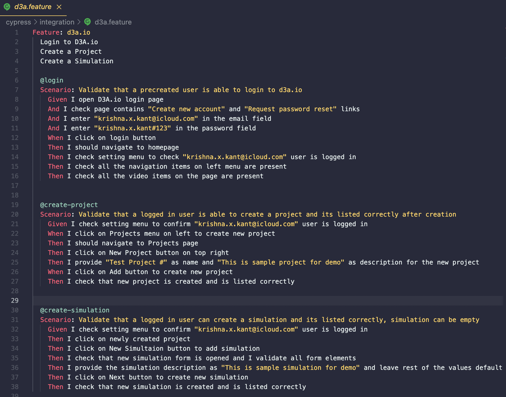
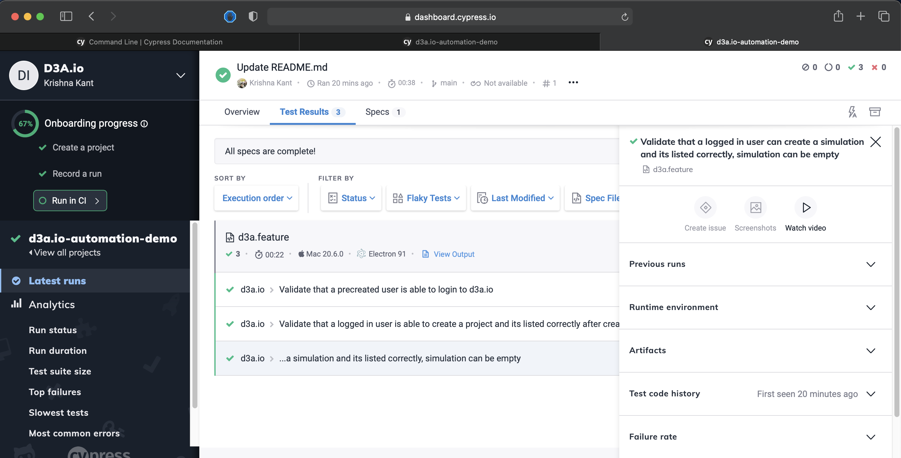
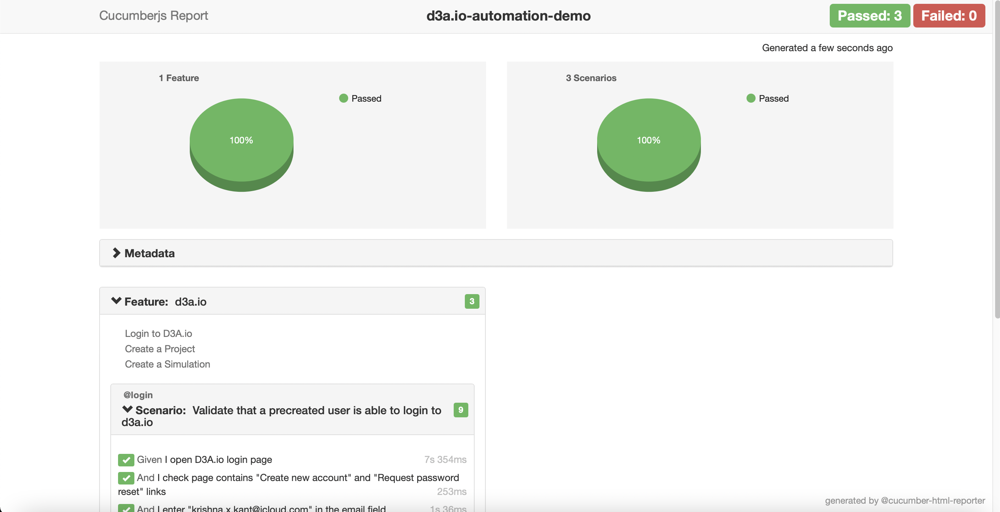

# d3a.io-automation-demo
d3a.io automation using cypress and javascript with Cucumber.

Test location : cypress/integration

# Feature file

 

# Run tests

```
npm install
``` 

## To run tests in background
```
npm test
``` 

## To run tests manually via cypress runner
```
npx cypress open
```
 

## To run tests in background and record on cypress dashboard to see video
```
npx cypress run --record --key 4ce5524b-be23-401b-bdeb-860e7ec61441
``` 
https://dashboard.cypress.io/projects/pv5nq9

 

## To generate cucumber reportn after test is complete
```
node cucumber-html-reporter.js
``` 

 


